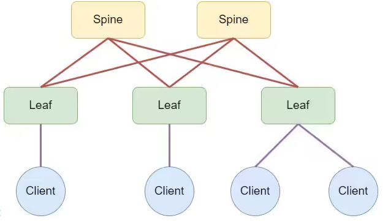
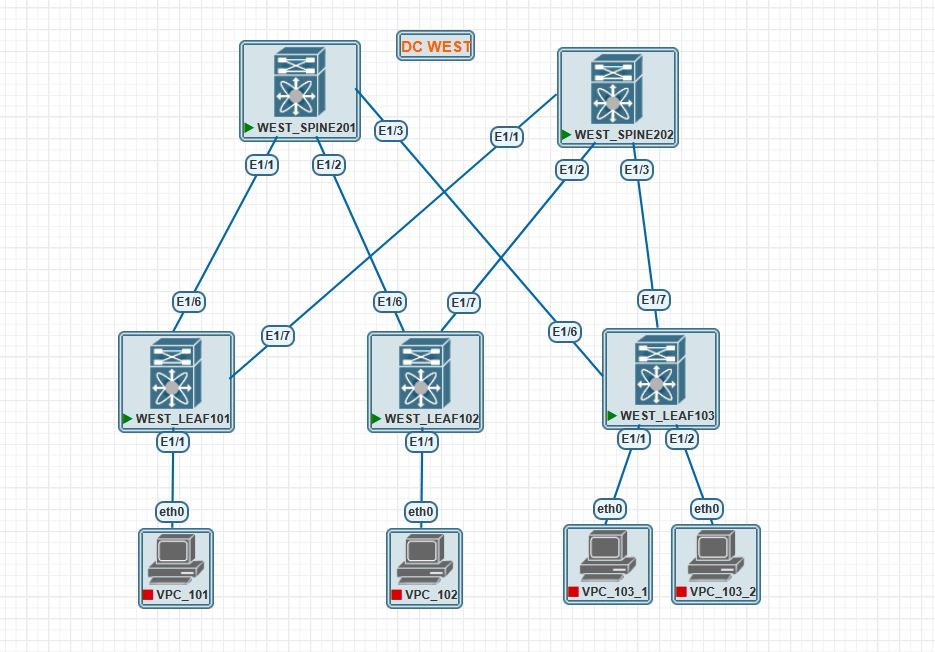

### Домашнее задание урока №3  Основы проектирования сети  модуля №1 Построение

##### Цель задания
- Собрать схему CLOS согласно топологии из двух Spine коммутаторов, 3 Leaf коммутаторов и 4 клиентских РМ согласно примера ниже
- Распределить адресное пространство.

##### Топология сети (пример)

 [](https://github.com/R0gerWilco/OTUS_DC/blob/main/Homework/Module1/Lesson03/CLOS_topology_example.JPG)

---

### Результаты ДЗ

### **1. Топология сети лабораторной работы PnetLAB**:

 [](https://github.com/R0gerWilco/OTUS_DC/blob/main/Homework/Module1/Lesson03/WEST_DC_topology.JPG)


### **2. Входные данные**:
- Название ЦОД - WEST (для будущего multi-site дизайна)
- 2 Spine коммутатора Nexus  с ID (номер) коммутаторов 201 и 202
- 3 Leaf коммутатора Nexus  с ID коммутаторов 101, 102 и 103
- ID коммутаторов должно стать часть IP-адресации Loopback и Underlay интерфейсов
- ID Leaf должно стать частью имени клиентских рабочих мест (VPC в терминологии PnetLAB)


### **3. Общая схема адресации**
- **Loopback-адреса** → `10.0.0.ID/32` (где ID = номер коммутатора) 
- **P2P-линки Spine ↔ Leaf** → `10.SpineID.LeafID.X/30` (SpineID = 201/202, LeafID = 101/102/103, X=1 для Spine и X=2 для Leaf ).  
- **Management-сеть** → `192.168.1.ID/24`  (где ID = номер коммутатора)  


### **4. Подробное раcпределение IP-адресов**
#### **4.1. Loopback-адреса (для протоколов BGP/OSPF/IS-IS)**
| Устройство        | Loopback (IPv4)  | Маска  | Назначение |  
|-------------------|------------------|--------|------------|
| **WEST_SPINE201** | `10.0.0.201/32`  | `/32`  | Underlay   |
| **WEST_SPINE202** | `10.0.0.202/32`  | `/32`  | Underlay   |
| **WEST_LEAF101**  | `10.0.0.101/32`  | `/32`  | Underlay   |
| **WEST_LEAF102**  | `10.0.0.102/32`  | `/32`  | Underlay   |
| **WEST_LEAF103**  | `10.0.0.103/32`  | `/32`  | Underlay   |

#### **4.2. P2P-линки (Spine ↔ Leaf)**
Используем **`/30`**  для экономии адресов (_Примечание: Nexus 9K в лабе не захотел работать с /31 P2P-линками Spine ↔ Leaf , в качестве  quick workaround используются /30 адресация_)   
Формат IP-адреса: **`10.SpineID.LeafID.0/30`**, где
   - Первый октет (`10`)  -принадлежность сети к RFC1918 диапазону 10.0.0.0/8
   - Второй октет (`201`) – идентификатор Spine.  
   - Третий октет (`101`) – идентификатор Leaf.  
   - Четвёртый октет (`.1` для Spine, `.2` для Leaf)

**Итоговая таблица P2P соединений:**

| Соединение (w/o DC Name)| Spine-адрес       | Leaf-адрес        | Подсеть            |
|-------------------------|-------------------|-------------------|--------------------|
| **Spine201 ↔ Leaf101**  | `10.201.101.1/30` | `10.201.101.2/30` | `10.201.101.0/30`  |
| **Spine201 ↔ Leaf102**  | `10.201.102.1/30` | `10.201.102.2/30` | `10.201.102.0/30`  |
| **Spine201 ↔ Leaf103**  | `10.201.103.1/30` | `10.201.103.2/30` | `10.201.103.0/30`  |
| **Spine202 ↔ Leaf101**  | `10.202.101.1/30` | `10.202.101.2/30` | `10.202.101.0/30`  |
| **Spine202 ↔ Leaf102**  | `10.202.102.1/30` | `10.202.102.2/30` | `10.202.102.0/30`  |
| **Spine202 ↔ Leaf103**  | `10.202.103.1/30` | `10.202.103.2/30` | `10.202.103.0/30`  |


#### **4.3. Management-сеть (Out-of-Band)**
| Устройство        | Management-адрес | Маска  |
|-------------------|------------------|--------|
| **WEST_SPINE201** | `192.168.1.201`  | `/24`  |
| **WEST_SPINE202** | `192.168.1.202`  | `/24`  |
| **WEST_LEAF101**  | `192.168.1.101`  | `/24`  |
| **WEST_LEAF102**  | `192.168.1.102`  | `/24`  |
| **WEST_LEAF103**  | `192.168.1.103`  | `/24`  |

---
#### **Пример конфигурации (WEST_SPINE201 ↔ WEST_LEAF101)**
**WEST_SPINE201:**
```bash
interface Ethernet1/1
  description TO_LEAF101
  no switchport
  ip address 10.201.101.1/30
  mtu 9216
```

**WEST_LEAF101:**
```bash
interface Ethernet1/6
  description TO_SPINE201
  no switchport
  ip address 10.201.101.2/30
  mtu 9216
```

---

### **5. Проверка доступности LEAF коммутаторов с WEST_SPINE201**
```bash
WEST_SPINE201# show cdp ne
Device-ID          Local Intrfce  Hldtme Capability  Platform      Port ID
WEST_LEAF101(9L07512J2Q8)
                    Eth1/1         124    R S s     N9K-9000v     Eth1/6        
WEST_LEAF102(9I4LLD12KMX)
                    Eth1/2         127    R S s     N9K-9000v     Eth1/6        
WEST_LEAF103(9XEJ69W8IKX)
                    Eth1/3         167    R S s     N9K-9000v     Eth1/6        

WEST_SPINE201# show ip arp
IP ARP Table for context default
Total number of entries: 3
Address         Age       MAC Address     Interface       Flags
10.201.101.2    00:02:27  5093.1500.e707  Ethernet1/1     
10.201.102.2    00:10:37  5079.0600.f207  Ethernet1/2     
10.201.103.2    00:17:57  5076.3c00.f707  Ethernet1/3  
```

### **6. Проверка доступности LEAF коммутаторов с WEST_SPINE202**
```bash
WEST_SPINE202# show cdp ne
Device-ID          Local Intrfce  Hldtme Capability  Platform      Port ID
WEST_LEAF101(9L07512J2Q8)
                    Eth1/1         141    R S s     N9K-9000v     Eth1/7        
WEST_LEAF102(9I4LLD12KMX)
                    Eth1/2         121    R S s     N9K-9000v     Eth1/7        
WEST_LEAF103(9XEJ69W8IKX)
                    Eth1/3         178    R S s     N9K-9000v     Eth1/7     

WEST_SPINE202# show ip arp
IP ARP Table for context default
Total number of entries: 3
Address         Age       MAC Address     Interface       Flags
10.202.101.2    00:09:10  5093.1500.e707  Ethernet1/1     
10.202.102.2    00:09:10  5079.0600.f207  Ethernet1/2     
10.202.103.2    00:08:57  5076.3c00.f707  Ethernet1/3    
```
