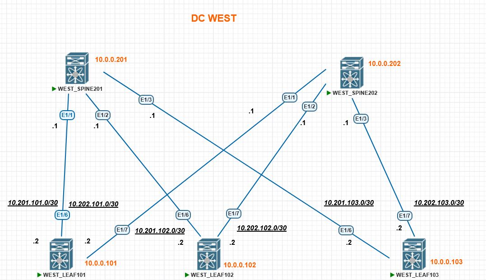

### Домашнее задание урока №2  Построение Underlay сети (OSPF) модуля №2 Построение

##### Цель задания
- Настроить OSPF в Underlay сети для IP связанности между всеми сетевыми устройствами.
- Зафиксировать в документации план работы, адресное пространство, схему сети, конфигурацию устройств
- Убедиться в наличии IP связанности между устройствами в OSFP домене


---

### Результаты ДЗ

### **1. Топология сети лабораторной работы в PnetLAB**:

 [](https://github.com/R0gerWilco/OTUS_DC/blob/main/Homework/Module2/Lesson02/WEST_DC_topology_for_OSPF_1.JPG)

---

### **2. Входные данные**:
- ID коммутаторов, IP-адресация сохранены с предыдущей топологии, списки IP-адресов указаны в [README файле первого домашнего задания](https://github.com/R0gerWilco/OTUS_DC/blob/main/Homework/Module1/Lesson03/README.md, а также отображены на схеме сети 
- Все интерфейсы (PtP, Loopback) используются в общей backbone Area 0.0.0.0 т.к. в текущем варианте лабной топологии (без multipod/multisite) нет острой необходимости деления OSPF домена на разные зоны 
- IP-адрес интерфейса Loopback0 указан в качестве OSPF Router-ID сооответствующего коммутатора
- На PtP настроен протокол BFD с TX/RX = 100ms * multiplier 3
- Значения таймеров OSPF оставлены по умолачнию: Hello 10, Dead 40, Wait 40, Retransmit 5


---
#### **3. Типовая конфигурация OSPF на примере коммутатора WEST_LEAF101**
```bash
feature ospf

  interface Ethernet1/6
  description TO_SPINE201
  no switchport
  mtu 9216
  bfd ipv4 interval 100 min_rx 100 multiplier 3
  ip address 10.201.101.2/30
  ip ospf network point-to-point
  no ip ospf passive-interface
  ip router ospf UNDERLAY area 0.0.0.0
  no shutdown

interface Ethernet1/7
  description TO_SPINE202
  no switchport
  mtu 9216
  bfd ipv4 interval 100 min_rx 100 multiplier 3
  ip address 10.202.101.2/30
  ip ospf network point-to-point
  no ip ospf passive-interface
  ip router ospf UNDERLAY area 0.0.0.0
  no shutdown

interface loopback0
  description LoopBack_LEAF101
  ip address 10.0.0.101/32
  ip router ospf UNDERLAY area 0.0.0.0

router ospf UNDERLAY
  bfd
  router-id 10.0.0.101
  passive-interface default
```

---

### **6. Проверка доступности LEAF коммутаторов с WEST_SPINE201**
```bash
WEST_SPINE201# show cdp ne
Device-ID          Local Intrfce  Hldtme Capability  Platform      Port ID
WEST_LEAF101(9L07512J2Q8)
                    Eth1/1         124    R S s     N9K-9000v     Eth1/6        
WEST_LEAF102(9I4LLD12KMX)
                    Eth1/2         127    R S s     N9K-9000v     Eth1/6        
WEST_LEAF103(9XEJ69W8IKX)
                    Eth1/3         167    R S s     N9K-9000v     Eth1/6        

WEST_SPINE201# show ip arp
IP ARP Table for context default
Total number of entries: 3
Address         Age       MAC Address     Interface       Flags
10.201.101.2    00:02:27  5093.1500.e707  Ethernet1/1     
10.201.102.2    00:10:37  5079.0600.f207  Ethernet1/2     
10.201.103.2    00:17:57  5076.3c00.f707  Ethernet1/3  
```

### **7. Проверка доступности LEAF коммутаторов с WEST_SPINE202**
```bash
WEST_SPINE202# show cdp ne
Device-ID          Local Intrfce  Hldtme Capability  Platform      Port ID
WEST_LEAF101(9L07512J2Q8)
                    Eth1/1         141    R S s     N9K-9000v     Eth1/7        
WEST_LEAF102(9I4LLD12KMX)
                    Eth1/2         121    R S s     N9K-9000v     Eth1/7        
WEST_LEAF103(9XEJ69W8IKX)
                    Eth1/3         178    R S s     N9K-9000v     Eth1/7     

WEST_SPINE202# show ip arp
IP ARP Table for context default
Total number of entries: 3
Address         Age       MAC Address     Interface       Flags
10.202.101.2    00:09:10  5093.1500.e707  Ethernet1/1     
10.202.102.2    00:09:10  5079.0600.f207  Ethernet1/2     
10.202.103.2    00:08:57  5076.3c00.f707  Ethernet1/3    
```

