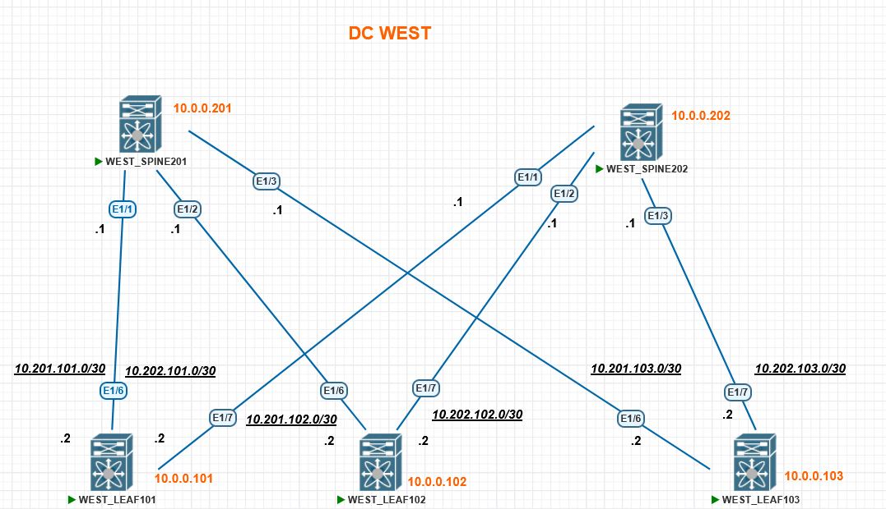

### Домашнее задание в модуле №2 урок №5  Построение Underlay сети (BGP)

##### Цель задания
- Настроить BGP в Underlay сети для IP связанности между всеми сетевыми устройствами. iBGP или eBGP - решать вам!
- Зафиксировать в документации план работы, адресное пространство, схему сети, конфигурацию устройств
- Убедиться в наличии IP связанности между устройствами в BGP домене


---

### Результаты ДЗ

### **1. Топология сети IPv4 лабораторной работы в PnetLAB**:
 
 Используем уже привычную по предыдущим урокам и домашним заданиям схему сети, но на сей раз только её IPv4 вариант 

 [](https://github.com/R0gerWilco/OTUS_DC/blob/main/Homework/Module2/Lesson05/WEST_DC_topology_for_BGP.JPG)


---

### **2. Входные данные**:
#### **2.1. Общая информация**

- Поскольку в условиях указано "iBGP или eBGP - решать вам!", для целей этого ДЗ выбран протокол iBGP
- Общая AS в BGP-домене 64777
- Используется аутентификация BGP-соседей  с применением хеширования MD5 на PtP линках
- IPv4-адресация сохранена с предыдущей топологии,  IP-адреса коммутаторов и PtP линков указаны в [README файле первого домашнего задания](https://github.com/R0gerWilco/OTUS_DC/blob/main/Homework/Module1/Lesson03/README.md), а также отображены на схеме сети  IPv4
- Spine-коммутаторы указаны как route-reflector, Leaf-коммутаторы   - как RR Client


---
### **4. Типовая конфигурация ISIS на примере коммутатора WEST_LEAF101**
```bash
feature isis

key chain ISISKey
  key 1
    key-string 7 073a0f686b3b35242e

router isis UNDERLAY
  net 49.0001.0000.0000.0101.00
  is-type level-2
  address-family ipv4 unicast
  address-family ipv6 unicast


  interface Ethernet1/6
  description TO_SPINE201
  no switchport
  no ip redirects
  ip address 10.201.101.2/30
  ip verify unicast source reachable-via rx
  ipv6 address 10:201:101::2/127
  no ipv6 redirects
  isis network point-to-point
  isis circuit-type level-2
  isis authentication-type md5
  isis authentication key-chain ISISKey
  ip router isis UNDERLAY
  ipv6 router isis UNDERLAY
  no isis passive-interface level-2
  no shutdown

interface Ethernet1/7
  description TO_SPINE202
  no switchport
  no ip redirects
  ip address 10.202.101.2/30
  ip verify unicast source reachable-via rx
  ipv6 address 10:202:101::2/127
  no ipv6 redirects
  isis network point-to-point
  isis circuit-type level-2
  isis authentication-type md5
  isis authentication key-chain ISISKey
  ip router isis UNDERLAY
  ipv6 router isis UNDERLAY
  no isis passive-interface level-2
  no shutdown

interface loopback0
  description LoopBack_LEAF101
  ip address 10.0.0.101/32
  ipv6 address 10::101/128
  ip router isis UNDERLAY
  ipv6 router isis UNDERLAY
```

### **5. Типичное состояние процесса ISIS на примере коммутатора WEST_LEAF101**
```bash
WEST_LEAF101# show isis UNDERLAY 
ISIS process : UNDERLAY
 Instance number :  1
 UUID: 1090519320
 Process ID 14477
VRF: default
  System ID : 0000.0000.0101  IS-Type : L2
  SAP : 412  Queue Handle : 13
  Maximum LSP MTU: 1492
  Stateful HA enabled
  Graceful Restart enabled. State: Inactive 
  Last graceful restart status : none
  Start-Mode Complete
  BFD IPv4 is globally disabled for ISIS process: UNDERLAY
  BFD IPv6 is globally disabled for ISIS process: UNDERLAY
  Topology-mode is base
  Metric-style : advertise(wide), accept(narrow, wide)
  Area address(es) :
    49.0001
  Process is up and running
  VRF ID: 1
  Stale routes during non-graceful controlled restart
  Enable resolution of L3->L2 address for ISIS adjacency
  SRTE: Not registered
  OAM: Not registered
  SR IPv4 is not configured and disabled for ISIS process: UNDERLAY
  SR IPv6 is not configured and disabled for ISIS process: UNDERLAY
SRv6 feature not present
  Interfaces supported by IS-IS :
    loopback0
    Ethernet1/6
    Ethernet1/7
  Topology : 0
  Address family IPv4 unicast :
    Number of interface : 3
    Distance : 115
    Default-information not originated
  Address family IPv6 unicast :
    Number of interface : 3
    Distance : 115
    Default-information not originated
  Topology : 2
  Address family IPv4 unicast :
    Number of interface : 0
    Distance : 115
    Default-information not originated
  Address family IPv6 unicast :
    Number of interface : 0
    Distance : 115
    Default-information not originated
  Level1
  No auth type and keychain
  Auth check set
  Level2
  No auth type and keychain
  Auth check set
  L1 Next SPF: Inactive
  L2 Next SPF: Inactive
  Attached bits
   MT-0 L-1: Att 0 Spf-att 0 Cfg 1 Adv-att 0
   MT-0 L-2: Att 0 Spf-att 0 Cfg 1 Adv-att 0
```

---

### **6. Проверка таблицы ISIS соседства на SPINE коммутаторах**
```bash
WEST_SPINE201# show isis adjacency 
IS-IS process: UNDERLAY VRF: default
IS-IS adjacency database:
Legend: '!': No AF level connectivity in given topology
System ID       SNPA            Level  State  Hold Time  Interface
WEST_LEAF101    N/A             2      UP     00:00:26   Ethernet1/1       <----------------------- LEAF 101
WEST_LEAF102    N/A             2      UP     00:00:30   Ethernet1/2       <----------------------- LEAF 102
WEST_LEAF103    N/A             2      UP     00:00:26   Ethernet1/3       <----------------------- LEAF 103

WEST_SPINE202# show isis adjacency 
IS-IS process: UNDERLAY VRF: default
IS-IS adjacency database:
Legend: '!': No AF level connectivity in given topology
System ID       SNPA            Level  State  Hold Time  Interface
WEST_LEAF101    N/A             2      UP     00:00:32   Ethernet1/1        <----------------------- LEAF 101
WEST_LEAF102    N/A             2      UP     00:00:32   Ethernet1/2        <----------------------- LEAF 102
WEST_LEAF103    N/A             2      UP     00:00:28   Ethernet1/3        <----------------------- LEAF 103
```


---

### **7. Проверка таблицы маршрутизации IPv4 на примере LEAF коммутатора WEST_LEAF101**
```bash

WEST_LEAF101# show ip route isis-UNDERLAY
10.0.0.102/32, ubest/mbest: 2/0                                        <-----------------------Loopback LEAF 102 via SPINE 201 & SPINE 202
    *via 10.201.101.1, Eth1/6, [115/81], 00:07:12, isis-UNDERLAY, L2
    *via 10.202.101.1, Eth1/7, [115/81], 00:07:19, isis-UNDERLAY, L2
10.0.0.103/32, ubest/mbest: 2/0                                        <-----------------------Loopback LEAF 103 via SPINE 201 & SPINE 202
    *via 10.201.101.1, Eth1/6, [115/81], 00:07:12, isis-UNDERLAY, L2
    *via 10.202.101.1, Eth1/7, [115/81], 00:07:03, isis-UNDERLAY, L2
10.0.0.201/32, ubest/mbest: 1/0                                        <-----------------------Loopback SPINE 201 via SPINE 201
    *via 10.201.101.1, Eth1/6, [115/41], 00:07:12, isis-UNDERLAY, L2
10.0.0.202/32, ubest/mbest: 1/0                                        <-----------------------Loopback SPINE 202 via SPINE 202   
    *via 10.202.101.1, Eth1/7, [115/41], 00:07:20, isis-UNDERLAY, L2
10.201.102.0/30, ubest/mbest: 1/0                                      <-----------------------PtP LEAF 102 - SPINE 201 via SPINE 201
    *via 10.201.101.1, Eth1/6, [115/80], 00:07:12, isis-UNDERLAY, L2
10.201.103.0/30, ubest/mbest: 1/0                                      <-----------------------PtP LEAF 103 - SPINE 201 via SPINE 201
    *via 10.201.101.1, Eth1/6, [115/80], 00:07:12, isis-UNDERLAY, L2
10.202.102.0/30, ubest/mbest: 1/0                                      <-----------------------PtP LEAF 102 - SPINE 202 via SPINE 202
    *via 10.202.101.1, Eth1/7, [115/80], 00:07:19, isis-UNDERLAY, L2
10.202.103.0/30, ubest/mbest: 1/0                                      <-----------------------PtP LEAF 103 - SPINE 202 via SPINE 202
    *via 10.202.101.1, Eth1/7, [115/80], 00:07:20, isis-UNDERLAY, L2
```

### **8. Проверка доступности  IPv4 Loopback-интерфейсов коммутаторов фабрики с WEST_LEAF101**
```bash
WEST_LEAF101#  ping 10.0.0.102 source-interface Loopback0 coun 3       <-----------------------Loopback LEAF 102
PING 10.0.0.102 (10.0.0.102): 56 data bytes
64 bytes from 10.0.0.102: icmp_seq=0 ttl=253 time=64.97 ms
64 bytes from 10.0.0.102: icmp_seq=1 ttl=253 time=45.923 ms
64 bytes from 10.0.0.102: icmp_seq=2 ttl=253 time=51.285 ms
--- 10.0.0.102 ping statistics ---
3 packets transmitted, 3 packets received, 0.00% packet loss
round-trip min/avg/max = 45.923/54.059/64.97 ms

WEST_LEAF101#  ping 10.0.0.103 source-interface Loopback0 coun 3       <-----------------------Loopback LEAF 103
PING 10.0.0.103 (10.0.0.103): 56 data bytes
64 bytes from 10.0.0.103: icmp_seq=0 ttl=253 time=121.031 ms
64 bytes from 10.0.0.103: icmp_seq=1 ttl=253 time=36.289 ms
64 bytes from 10.0.0.103: icmp_seq=2 ttl=253 time=56.708 ms
--- 10.0.0.103 ping statistics ---
3 packets transmitted, 3 packets received, 0.00% packet loss
round-trip min/avg/max = 36.289/71.342/121.031 ms

WEST_LEAF101#  ping 10.0.0.201 source-interface Loopback0 coun 3       <-----------------------Loopback SPINE 201
PING 10.0.0.201 (10.0.0.201): 56 data bytes
64 bytes from 10.0.0.201: icmp_seq=0 ttl=254 time=81.354 ms
64 bytes from 10.0.0.201: icmp_seq=1 ttl=254 time=64.392 ms
64 bytes from 10.0.0.201: icmp_seq=2 ttl=254 time=43.044 ms
--- 10.0.0.201 ping statistics ---
3 packets transmitted, 3 packets received, 0.00% packet loss
round-trip min/avg/max = 43.044/62.93/81.354 ms

WEST_LEAF101#  ping 10.0.0.202 source-interface Loopback0 coun 3        <-----------------------Loopback SPINE 202
PING 10.0.0.202 (10.0.0.202): 56 data bytes
64 bytes from 10.0.0.202: icmp_seq=0 ttl=254 time=88.83 ms
64 bytes from 10.0.0.202: icmp_seq=1 ttl=254 time=36.276 ms
64 bytes from 10.0.0.202: icmp_seq=2 ttl=254 time=39.43 ms
--- 10.0.0.202 ping statistics ---
3 packets transmitted, 3 packets received, 0.00% packet loss
round-trip min/avg/max = 36.276/54.845/88.83 ms
```


```


