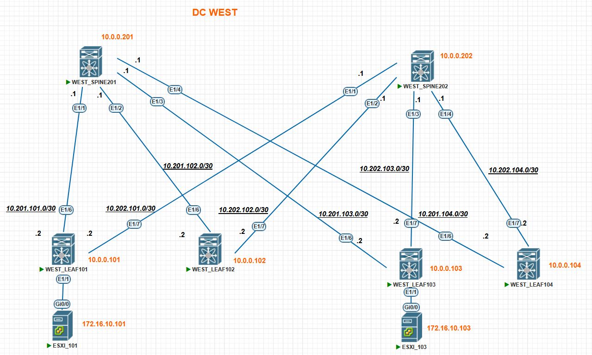

### Домашнее задание в модуле №3 урок №2 VxLAN EVPN L2

##### Цель задания
- Настройте BGP peering между Leaf и Spine в AF l2vpn evpn
- Настройте связанность между клиентами в первой зоне и убедитесь в её наличии
- Зафиксруйте в документации - план работы, адресное пространство, схему сети, конфигурацию устройств

---

### Результаты ДЗ

### **1. Топология сети IPv4 лабораторной работы в PnetLAB**:
 
 Немного дополнил привычную с прошлых ДЗ схему, введя в экслпуатацию дополнительный LEAF коммутатор с id 104 для будущих multihoming топологий
 
 Также введены в эксплуатацию два клиента в виде ESXi серверов, роль которых в лабе сыграют обычные Catalyst коммутаторы (от них требуется пинговалка и поддержка LACP для будущих multihoming топологий)
 
 Итоговая топология сети для данного ДЗ выглядит следующим образом:
 
 [](https://github.com/R0gerWilco/OTUS_DC/blob/main/Homework/Module3/Lesson02/WEST_DC_topology_for_VxLAN.JPG)


---

### **2. Входные данные**:

- Underlay протокол маршрутизации - OSPF, Overlay протокол маршрутизации - iBGP согласно [рекомендованному дизайну для Cisco Nexus](https://www.cisco.com/c/en/us/td/docs/dcn/whitepapers/cisco-vxlan-bgp-evpn-design-and-implementation-guide.html#IGPvseBGPUnderlay)
- Общая AS в BGP домене 64777, spine коммутаторы настроены как Route-reflector
- IPv4-адресация сохранена с предыдущей топологии,  IP-адреса коммутаторов и PtP линков указаны в [README файле первого домашнего задания](https://github.com/R0gerWilco/OTUS_DC/blob/main/Homework/Module1/Lesson03/README.md), а также отображены на схеме сети  IPv4. Адресация для Leaf 104 добавлена  в файл первого ДЗ
- Введена в эксплуатацию  подсеть для серверов 172.16.10.0/24 c VLAN ID 10 и ассоциированным с ним VNI 10010. Адресация для клиентов в этой сети также указана в топологии сети для данного ДЗ


---
### **3. Типовая конфигурация BGP Overlay и VxLAN EVPN Leaf-коммутатора на примере устройства WEST_LEAF101**
```bash

feature bgp
feature vn-segment-vlan-based
feature nv overlay

vlan 10
  name SERVERS_10
  vn-segment 10010


 interface nve1
  no shutdown
  description SERVERS_VLAN_10
  host-reachability protocol bgp
  source-interface loopback0
  member vni 10010
    ingress-replication protocol bgp

router bgp 64777
  router-id 10.0.0.101
  template peer SPINE
    remote-as 64777
    update-source loopback0
    address-family l2vpn evpn
      send-community
      send-community extended

 neighbor 10.0.0.201
    inherit peer SPINE
 
  neighbor 10.0.0.202
    inherit peer SPINE
```

### **4. Типовая конфигурация BGP Overlay Spine-коммутатора на примере устройства WEST_SPINE201**
```bash

feature bgp

 router bgp 64777
  router-id 10.0.0.201
  template peer LEAF
    remote-as 64777
    update-source loopback0
    address-family l2vpn evpn
      send-community
      send-community extended
      route-reflector-client

neighbor 10.0.0.101
    inherit peer LEAF
    remote-as 64777

 neighbor 10.0.0.102
    inherit peer LEAF
    remote-as 64777

 neighbor 10.0.0.103
    inherit peer LEAF
    remote-as 64777

neighbor 10.0.0.104
    inherit peer LEAF
    remote-as 64777
```

---

### **5. Проверка таблицы BGP соседства и VxLAN peers на LEAF коммутаторах на примере устройства WEST_LEAF101**
```bash

WEST_LEAF101# show bgp l2vpn  evpn sum
BGP summary information for VRF default, address family L2VPN EVPN
BGP router identifier 10.0.0.101, local AS number 64777
BGP table version is 128, L2VPN EVPN config peers 2, capable peers 2
7 network entries and 10 paths using 1680 bytes of memory
BGP attribute entries [7/1148], BGP AS path entries [0/0]
BGP community entries [0/0], BGP clusterlist entries [6/24]
Neighbor        V    AS MsgRcvd MsgSent   TblVer  InQ OutQ Up/Down  State/PfxRcd
10.0.0.201      4 64777    2299    2283      128    0    0    1d13h 3                   <----------------------- SPINE 201
10.0.0.202      4 64777    2309    2294      128    0    0    1d13h 3                   <----------------------- SPINE 202


WEST_LEAF101# show nve peers
Interface Peer-IP                                 State LearnType Uptime   Router-Mac       
--------- --------------------------------------  ----- --------- -------- ----------
nve1      10.0.0.102                              Up    CP        1d13h    n/a           <----------------------- LEAF 101
nve1      10.0.0.103                              Up    CP        1d13h    n/a           <----------------------- LEAF 102            
nve1      10.0.0.104                              Up    CP        1d13h    n/a           <----------------------- LEAF 103

```

---

### **6. Проверка таблицы маршрутизации на SPINE коммутаторах**

```bash

WEST_SPINE201# show ip route bgp-64777
10.0.0.101/32, ubest/mbest: 1/0                                           <----------------------- LEAF 101
    *via 10.201.101.2, [200/0], 1d02h, bgp-64777, internal, tag 64777
10.0.0.102/32, ubest/mbest: 1/0                                           <----------------------- LEAF 102
    *via 10.201.102.2, [200/0], 1d02h, bgp-64777, internal, tag 64777
10.0.0.103/32, ubest/mbest: 1/0                                           <----------------------- LEAF 103
    *via 10.201.103.2, [200/0], 1d02h, bgp-64777, internal, tag 64777


WEST_SPINE202# show ip route bgp-64777
10.0.0.101/32, ubest/mbest: 1/0                                           <----------------------- LEAF 101
    *via 10.202.101.2, [200/0], 1d02h, bgp-64777, internal, tag 64777
10.0.0.102/32, ubest/mbest: 1/0                                           <----------------------- LEAF 102
    *via 10.202.102.2, [200/0], 1d02h, bgp-64777, internal, tag 64777
10.0.0.103/32, ubest/mbest: 1/0                                           <----------------------- LEAF 103
    *via 10.202.103.2, [200/0], 1d02h, bgp-64777, internal, tag 64777
```


---

### **7. Проверка BGP маршрутов на примере LEAF коммутатора WEST_LEAF101**
```bash
WEST_LEAF101# show ip route bgp-64777 
IP Route Table for VRF "default"
'*' denotes best ucast next-hop
'**' denotes best mcast next-hop
'[x/y]' denotes [preference/metric]
'%<string>' in via output denotes VRF <string>

10.0.0.102/32, ubest/mbest: 2/0                                         <-----------------------Loopback LEAF 102 via SPINE 201 & SPINE 202
    *via 10.201.101.1, [200/0], 1d02h, bgp-64777, internal, tag 64777
    *via 10.202.101.1, [200/0], 1d02h, bgp-64777, internal, tag 64777
10.0.0.103/32, ubest/mbest: 2/0                                         <-----------------------Loopback LEAF 103 via SPINE 201 & SPINE 202
    *via 10.201.101.1, [200/0], 1d02h, bgp-64777, internal, tag 64777
    *via 10.202.101.1, [200/0], 1d02h, bgp-64777, internal, tag 64777
10.0.0.201/32, ubest/mbest: 1/0                                         <-----------------------Loopback SPINE 201 via SPINE 201
    *via 10.201.101.1, [200/0], 1d02h, bgp-64777, internal, tag 64777
10.0.0.202/32, ubest/mbest: 1/0                                         <-----------------------Loopback SPINE 202 via SPINE 202
    *via 10.202.101.1, [200/0], 1d02h, bgp-64777, internal, tag 64777
```

**Детализация маршуртной информации для сетей, доступных через multipath, на примере маршрута к Loopback LEAF102 10.0.0.102/32:**
```bash
WEST_LEAF101# show ip bgp 10.0.0.102/32
BGP routing table information for VRF default, address family IPv4 Unicast
BGP routing table entry for 10.0.0.102/32, version 14
Paths: (2 available, best #2)
Flags: (0x8008001a) (high32 00000000) on xmit-list, is in urib, is best urib rou
te, is in HW
Multipath: iBGP

  Path type: internal, path is valid, not best reason: Neighbor Address, multipa
th, no labeled nexthop, in rib
  AS-Path: NONE, path sourced internal to AS
    10.202.101.1 (metric 0) from 10.202.101.1 (10.0.0.202)
      Origin incomplete, MED 0, localpref 100, weight 0
      Originator: 10.0.0.102 Cluster list: 10.0.0.202        <--------------------Originator-ID:LEAF 102 Cluster-ID:SPINE 202                                          

  Advertised path-id 1
  Path type: internal, path is valid, is best path, no labeled nexthop, in rib
  AS-Path: NONE, path sourced internal to AS
    10.201.101.1 (metric 0) from 10.201.101.1 (10.0.0.201)
      Origin incomplete, MED 0, localpref 100, weight 0
      Originator: 10.0.0.102 Cluster list: 10.0.0.201        <--------------------Originator-ID:LEAF 102 Cluster-ID:SPINE 201  

```

### **8. Проверка доступности  IPv4 Loopback-интерфейсов коммутаторов фабрики с WEST_LEAF101**
```bash
WEST_LEAF101# ping 10.0.0.102 source-interface Loopback0 coun 3      <-----------------------Loopback LEAF 102
PING 10.0.0.102 (10.0.0.102): 56 data bytes
64 bytes from 10.0.0.102: icmp_seq=0 ttl=253 time=52.252 ms
64 bytes from 10.0.0.102: icmp_seq=1 ttl=253 time=31.474 ms
64 bytes from 10.0.0.102: icmp_seq=2 ttl=253 time=66.654 ms
--- 10.0.0.102 ping statistics ---
3 packets transmitted, 3 packets received, 0.00% packet loss
round-trip min/avg/max = 31.474/50.126/66.654 ms

WEST_LEAF101# ping 10.0.0.103 source-interface Loopback0 coun 3       <-----------------------Loopback LEAF 103
PING 10.0.0.103 (10.0.0.103): 56 data bytes
64 bytes from 10.0.0.103: icmp_seq=0 ttl=253 time=84.047 ms
64 bytes from 10.0.0.103: icmp_seq=1 ttl=253 time=63.98 ms
64 bytes from 10.0.0.103: icmp_seq=2 ttl=253 time=122.398 ms
--- 10.0.0.103 ping statistics ---
3 packets transmitted, 3 packets received, 0.00% packet loss
round-trip min/avg/max = 63.98/90.141/122.398 ms


WEST_LEAF101#  ping 10.0.0.201 source-interface Loopback0 coun 3       <-----------------------Loopback SPINE 201
PING 10.0.0.201 (10.0.0.201): 56 data bytes
64 bytes from 10.0.0.201: icmp_seq=0 ttl=254 time=26.45 ms
64 bytes from 10.0.0.201: icmp_seq=1 ttl=254 time=26.339 ms
64 bytes from 10.0.0.201: icmp_seq=2 ttl=254 time=32.959 ms
--- 10.0.0.201 ping statistics ---
3 packets transmitted, 3 packets received, 0.00% packet loss
round-trip min/avg/max = 26.339/28.582/32.959 ms

WEST_LEAF101#  ping 10.0.0.202 source-interface Loopback0 coun 3       <-----------------------Loopback SPINE 202
PING 10.0.0.202 (10.0.0.202): 56 data bytes
64 bytes from 10.0.0.202: icmp_seq=0 ttl=254 time=56.165 ms
64 bytes from 10.0.0.202: icmp_seq=1 ttl=254 time=60.278 ms
64 bytes from 10.0.0.202: icmp_seq=2 ttl=254 time=53.179 ms
--- 10.0.0.202 ping statistics ---
3 packets transmitted, 3 packets received, 0.00% packet loss
round-trip min/avg/max = 53.179/56.54/60.278 ms
```


