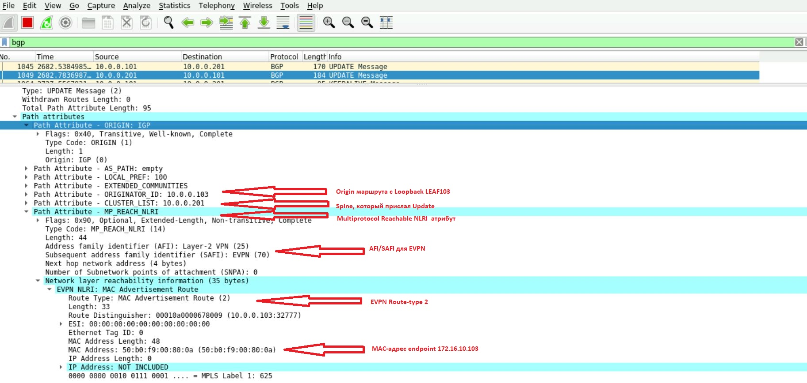

### Домашнее задание в модуле №3 урок №2 VxLAN EVPN L2 VNI

##### Цель задания
- Настройте BGP peering между Leaf и Spine в AF l2vpn evpn
- Настройте связанность между клиентами в первой зоне и убедитесь в её наличии
- Зафиксруйте в документации - план работы, адресное пространство, схему сети, конфигурацию устройств

---

### Результаты ДЗ

### **1. Топология сети IPv4 лабораторной работы в PnetLAB**:
 
 Немного дополнил привычную с прошлых ДЗ схему, введя в экслпуатацию дополнительный LEAF коммутатор с id 104 для будущих multihoming топологий
 
 Также введены в эксплуатацию два клиента в виде ESXi серверов, роль которых в лабе сыграют обычные Catalyst коммутаторы (от них требуется пинговалка и поддержка LACP для будущих multihoming топологий)
 
 Итоговая топология сети для данного ДЗ выглядит следующим образом:
 
 [](https://github.com/R0gerWilco/OTUS_DC/blob/main/Homework/Module3/Lesson02/WEST_DC_topology_for_VxLAN.JPG)


---

### **2. Входные данные**:

- Underlay протокол маршрутизации - OSPF, Overlay протокол маршрутизации - iBGP согласно [рекомендованному дизайну для Cisco Nexus](https://www.cisco.com/c/en/us/td/docs/dcn/whitepapers/cisco-vxlan-bgp-evpn-design-and-implementation-guide.html#IGPvseBGPUnderlay)
- Общая AS в BGP домене 64777, spine коммутаторы настроены как Route-reflector
- IPv4-адресация сохранена с предыдущей топологии,  IP-адреса коммутаторов и PtP линков указаны в [README файле первого домашнего задания](https://github.com/R0gerWilco/OTUS_DC/blob/main/Homework/Module1/Lesson03/README.md), а также отображены на схеме сети  IPv4. Адресация для Leaf 104 добавлена  в файл первого ДЗ
- Введена в эксплуатацию  подсеть для серверов 172.16.10.0/24 c VLAN ID 10 и ассоциированным с ним VNI 10010. Адресация для клиентов в этой сети также указана в топологии сети для данного ДЗ


---
### **3. Типовая конфигурация BGP Overlay и VxLAN EVPN Leaf-коммутатора на примере устройства WEST_LEAF101**
```bash

feature bgp
feature vn-segment-vlan-based
feature nv overlay

vlan 10
  name SERVERS_10
  vn-segment 10010

 interface nve1
  no shutdown
  host-reachability protocol bgp
  source-interface loopback0
  member vni 10010
    ingress-replication protocol bgp

evpn
  vni 10010 l2
    rd auto
    route-target both 64777:10010

router bgp 64777
  router-id 10.0.0.101
  template peer SPINE
    remote-as 64777
    update-source loopback0
    address-family l2vpn evpn
      send-community
      send-community extended

 neighbor 10.0.0.201
    inherit peer SPINE
 
  neighbor 10.0.0.202
    inherit peer SPINE
```

### **4. Типовая конфигурация BGP Overlay Spine-коммутатора на примере устройства WEST_SPINE201**
```bash

feature bgp

 router bgp 64777
  router-id 10.0.0.201
  template peer LEAF
    remote-as 64777
    update-source loopback0
    address-family l2vpn evpn
      send-community
      send-community extended
      route-reflector-client

neighbor 10.0.0.101
    inherit peer LEAF
    remote-as 64777

 neighbor 10.0.0.102
    inherit peer LEAF
    remote-as 64777

 neighbor 10.0.0.103
    inherit peer LEAF
    remote-as 64777

neighbor 10.0.0.104
    inherit peer LEAF
    remote-as 64777
```

---

### **5. Проверка таблицы BGP соседства и VxLAN peers на LEAF коммутаторах на примере устройства WEST_LEAF101**
```bash

WEST_LEAF101# show bgp l2vpn  evpn sum
BGP summary information for VRF default, address family L2VPN EVPN
BGP router identifier 10.0.0.101, local AS number 64777
BGP table version is 128, L2VPN EVPN config peers 2, capable peers 2
7 network entries and 10 paths using 1680 bytes of memory
BGP attribute entries [7/1148], BGP AS path entries [0/0]
BGP community entries [0/0], BGP clusterlist entries [6/24]
Neighbor        V    AS MsgRcvd MsgSent   TblVer  InQ OutQ Up/Down  State/PfxRcd
10.0.0.201      4 64777    2299    2283      128    0    0    1d13h 3                   <----------------------- SPINE 201
10.0.0.202      4 64777    2309    2294      128    0    0    1d13h 3                   <----------------------- SPINE 202


WEST_LEAF101# show nve peers
Interface Peer-IP                                 State LearnType Uptime   Router-Mac       
--------- --------------------------------------  ----- --------- -------- ----------
nve1      10.0.0.102                              Up    CP        1d13h    n/a           <----------------------- LEAF 101
nve1      10.0.0.103                              Up    CP        1d13h    n/a           <----------------------- LEAF 102            
nve1      10.0.0.104                              Up    CP        1d13h    n/a           <----------------------- LEAF 103


```

---

### **6. Проверка связности клиентских устройств в серверной сети 172.16.10.0/24**

```bash

WEST_ESXI_101#show run int vlan 10
interface Vlan10
 ip address 172.16.10.101 255.255.255.0
end

WEST_ESXI_101#ping 172.16.10.103 sour Vlan10
Type escape sequence to abort.
Sending 5, 100-byte ICMP Echos to 172.16.10.103, timeout is 2 seconds:
Packet sent with a source address of 172.16.10.101 
!!!!!
Success rate is 100 percent (5/5), round-trip min/avg/max = 50/66/93 ms
WEST_ESXI_101#

```
---

### **7. Проверка EVPN  route-type 2/3 маршрутов на LEAF коммутаторах  WEST_LEAF101 и WEST_LEAF103**

**LEAF101**

```bash
WEST_LEAF101# show bgp l2vpn evpn  vni-id 10010
BGP routing table information for VRF default, address family L2VPN EVPN
BGP table version is 132, Local Router ID is 10.0.0.101
Status: s-suppressed, x-deleted, S-stale, d-dampened, h-history, *-valid, >-best
Path type: i-internal, e-external, c-confed, l-local, a-aggregate, r-redist, I-i
njected
Origin codes: i - IGP, e - EGP, ? - incomplete, | - multipath, & - backup, 2 - b
est2

   Network                                               Next Hop  Metric LocPrf     Weight Path
Route Distinguisher: 10.0.0.101:32777    (L2VNI 10010)

*>l[2]:[0]:[0]:[48]:[504c.d600.800a]:[0]:[0.0.0.0]/216 10.0.0.101          100      32768 i   <------------Хост WEST_ESXI_101, подключенный к своему порту
>i[2]:[0]:[0]:[48]:[50b0.f900.800a]:[0]:[0.0.0.0]/216  10.0.0.103          100          0 i    <-----------Хост WEST_ESXI_103, подключенный к LEAF 103

*>l[3]:[0]:[32]:[10.0.0.101]/88                         10.0.0.101         100      32768 i   <------------Cвой собственный Loopback
*>i[3]:[0]:[32]:[10.0.0.102]/88                         10.0.0.102         100          0 i   <------------Loopback LEAF 102 
*>i[3]:[0]:[32]:[10.0.0.103]/88                         10.0.0.103         100          0 i   <------------Loopback LEAF 103
*>i[3]:[0]:[32]:[10.0.0.104]/88                         10.0.0.104         100          0 i   <------------Loopback LEAF 104


```

**LEAF103**

```bash
WEST_LEAF103# show bgp l2vpn evpn  vni-id 10010
BGP routing table information for VRF default, address family L2VPN EVPN
BGP table version is 132, Local Router ID is 10.0.0.103
Status: s-suppressed, x-deleted, S-stale, d-dampened, h-history, *-valid, >-best
Path type: i-internal, e-external, c-confed, l-local, a-aggregate, r-redist, I-i
njected
Origin codes: i - IGP, e - EGP, ? - incomplete, | - multipath, & - backup, 2 - b
est2

   Network                                               Next Hop  Metric LocPrf     Weight Path
Route Distinguisher: 10.0.0.101:32777    (L2VNI 10010)

*>i[2]:[0]:[0]:[48]:[504c.d600.800a]:[0]:[0.0.0.0]/216 10.0.0.101         100          0 i    <-----------Хост WEST_ESXI_101, подключенный к LEAF 101
*>l[2]:[0]:[0]:[48]:[50b0.f900.800a]:[0]:[0.0.0.0]/216 10.0.0.103         100      32768 i    <-----------Хост WEST_ESXI_103, подключенный к своему порту

*>l[3]:[0]:[32]:[10.0.0.101]/88                         10.0.0.101        100          0 i   <------------Loopback LEAF 101
*>i[3]:[0]:[32]:[10.0.0.102]/88                         10.0.0.102        100          0 i   <------------Loopback LEAF 102 
*>i[3]:[0]:[32]:[10.0.0.103]/88                         10.0.0.103        100     32768  i   <------------Cвой собственный Loopback
*>i[3]:[0]:[32]:[10.0.0.104]/88                         10.0.0.104        100          0 i   <------------Loopback LEAF 104

```
---

### **8. Скриншот BGP-апдейта с EVPN  route-type 2 маршрутом для endpoint`а WEST_ESXI_103 172.16.10.103  на коммутаторе  WEST_LEAF101**

 [](https://github.com/R0gerWilco/OTUS_DC/blob/main/Homework/Module3/Lesson02/BGP_update_reachable_route.JPG)


