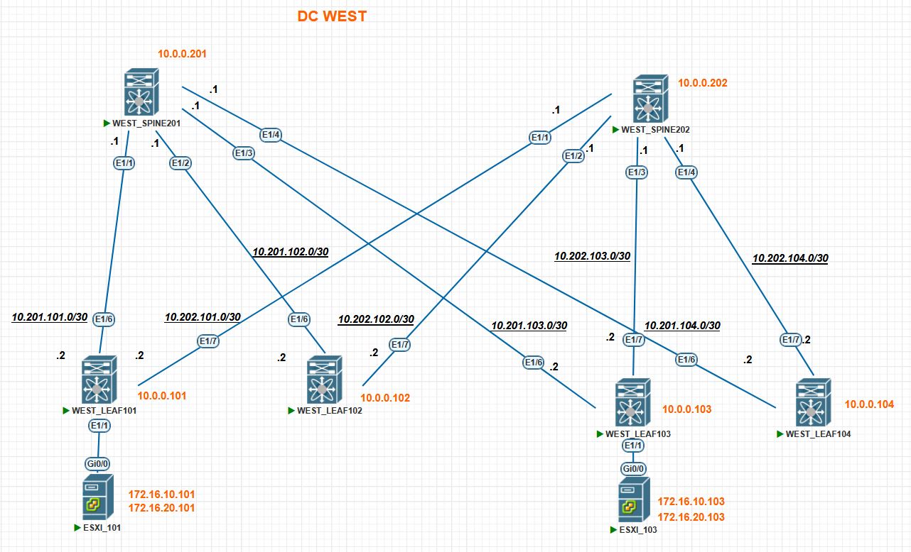

### Домашнее задание в модуле №3 урок №2 VxLAN EVPN L3 VNI

##### Цель задания
- Настройте каждого клиента в своем VNI
- Настройте маршрутизацию между клиентами.
- Зафиксируйте в документации - план работы, адресное пространство, схему сети, конфигурацию уст

---

### Результаты ДЗ

### **1. Топология сети IPv4 лабораторной работы в PnetLAB**:

Итоговая топология сети для данного ДЗ выглядит следующим образом:
 
 [](https://github.com/R0gerWilco/OTUS_DC/blob/main/Homework/Module3/Lesson02/WEST_DC_topology_for_VxLAN_L3VNI.JPG)


---

### **2. Входные данные**:

- Конфигурация Underlay/Overlay протоколов не менялась по сравнению с [прошлым ДЗ для L2VNI](https://github.com/R0gerWilco/OTUS_DC/blob/main/Homework/Module3/Lesson02/README.md)
- IPv4-адресация сохранена с предыдущей топологии,  IP-адреса коммутаторов и PtP линков указаны в [README файле первого домашнего задания](https://github.com/R0gerWilco/OTUS_DC/blob/main/Homework/Module1/Lesson03/README.md), а также отображены на схеме сети  IPv4.
- Введена в эксплуатацию  подсеть для серверов 172.16.10.0/24 c VLAN ID 10 и ассоциированным с ним VNI 10010. Шлюз по умолчанию в этой подсети 172.16.10.1. Клиент в этой сети подключен к LEAF 101
- Введена в эксплуатацию  подсеть для серверов 172.16.20.0/24 c VLAN ID 20 и ассоциированным с ним VNI 10020. Шлюз по умолчанию в этой подсети 172.16.20.1. Клиент в этой сети подключен к LEAF 103
- Обе подсети выше добавлены в VRF INTERNAL
- Поскольку у нас в лабе Nexus`ы, то тип IRB без вариантов симметричный, для маршрутизации между VNI введен в эксплуатацию VLAN 777 и ассоциированный с ним VNI 10777
- Для внутренних подсетей с VNI 10010 и VNI 10020 настроен ARP suppression, для чего на всех LEAF коммутаторах проведен тюнинг TCAM для выделения достаточного кусочка этой памяти на работу фичи. Как это все работает для Nexus 9000v решительно непонятно, но без заветной команды фича ARP suppression не включалась.

---
### **3. Типовая конфигурация VxLAN EVPN Leaf-коммутатора на примере устройства WEST_LEAF101**
```bash

feature vn-segment-vlan-based
feature nv overlay

hardware access-list tcam region arp-ether 256 double-wide

vlan 10
  name SERVERS_10
  vn-segment 10010
vlan 10
  name SERVERS_20
  vn-segment 10020
vlan 777
  vn-segment 10777

vrf context INTERNAL
  vni 10777
  rd auto
  address-family ipv4 unicast
    route-target import 64777:10777
    route-target import 64777:10777 evpn
    route-target export 64777:10777
    route-target export 64777:10777 evpn

interface Vlan10
  no shutdown
  vrf member INTERNAL
  ip address 172.16.10.1/24
  fabric forwarding mode anycast-gateway

interface Vlan20
  no shutdown
  vrf member INTERNAL
  ip address 172.16.20.1/24
  fabric forwarding mode anycast-gateway

interface Vlan777
  no shutdown
  mtu 9216
  vrf member INTERNAL
  ip forward

interface nve1
  no shutdown
  host-reachability protocol bgp
  source-interface loopback0
  member vni 10010
    suppress-arp
    ingress-replication protocol bgp
  member vni 10020
    suppress-arp
    ingress-replication protocol bgp
  member vni 10777 associate-vrf

evpn
  vni 10010 l2
    route-target import 64777:10010
    route-target export 64777:10010
  vni 10020 l2
    route-target import 64777:10020
    route-target export 64777:10020

```
### **4. Проверка таблицы  VxLAN peers на LEAF коммутаторах на примере устройства WEST_LEAF101**
```bash
WEST_LEAF101# show nve peers det
Peer-Ip: 10.0.0.102
    NVE Interface       : nve1
    Peer State          : Up
    Peer Uptime         : 1d01h
    Router-Mac          : n/a
    Peer First VNI      : 10010
    Time since Create   : 1d01h
    Configured VNIs     : 10010,10020,10777
    Provision State     : peer-add-complete
    Learnt CP VNIs      : 10010,10020
    vni assignment mode : SYMMETRIC
    Peer Location       : N/A
Peer-Ip: 10.0.0.103
    NVE Interface       : nve1
    Peer State          : Up
    Peer Uptime         : 1d01h
    Router-Mac          : 5076.3c00.f707                       <--------------- Появился Router-MAC от LEAF 103
    Peer First VNI      : 10010
    Time since Create   : 1d01h
    Configured VNIs     : 10010,10020,10777
    Provision State     : peer-add-complete
    Learnt CP VNIs      : 10010,10020,10777                    <--------------- Появился Learnt L3 VNI 10777 от LEAF 103  
    vni assignment mode : SYMMETRIC
    Peer Location       : N/A
Peer-Ip: 10.0.0.104
    NVE Interface       : nve1
    Peer State          : Up
    Peer Uptime         : 1d01h
    Router-Mac          : n/a
    Peer First VNI      : 10010
    Time since Create   : 1d01h
    Configured VNIs     : 10010,10020,10777
    Provision State     : peer-add-complete
    Learnt CP VNIs      : 10010,10020
    vni assignment mode : SYMMETRIC
    Peer Location       : N/A
```

---

### **5. Проверка ARP-таблиц на LEAF коммутаторах и клиентских устройствах**
**LEAF101**
```bash
WEST_LEAF101# show ip arp vrf INTERNAL 
IP ARP Table for context INTERNAL
Total number of entries: 2
Address         Age       MAC Address     Interface       
172.16.10.101   00:05:08  504c.d600.800a  Vlan10        <----------- Хост WEST_ESXI_101 в VLAN 10  
```

**LEAF103**
```bash
WEST_LEAF103# show ip arp vrf INTERNAL
Total number of entries: 2
Address         Age       MAC Address     Interface       
172.16.20.103   00:05:10  50b0.f900.8014  Vlan20        <----------- Хост WEST_ESXI_103 в VLAN 20    
```
**WEST_ESXI_101**
```bash
WEST_ESXI_101#show ip arp
Protocol  Address          Age (min)  Hardware Addr   Type   Interface
Internet  172.16.10.1             6   0001.0001.0001  ARPA   Vlan10    <----------- Virtual MAC VLAN 10
Internet  172.16.10.101           -   504c.d600.800a  ARPA   Vlan10    <----------- Свой IP адрес в VLAN 10
```
**WEST_ESXI_103**
```bash
WEST_ESXI_103#sho ip arp
Protocol  Address          Age (min)  Hardware Addr   Type   Interface
Internet  172.16.20.1             0   0001.0001.0001  ARPA   Vlan20        <----------- Virtual MAC VLAN 20
Internet  172.16.20.103           -   50b0.f900.8014  ARPA   Vlan20        <----------- Свой IP адрес в VLAN 20
```

### **6. Проверка маршрутов  для клиентских IP на LEAF коммутаторах**

**LEAF101**
```bash
WEST_LEAF101# show ip route bgp-64777  vrf INTERNAL

172.16.20.103/32, ubest/mbest: 1/0                                     <----------- Хост WEST_ESXI_103 в VLAN 20 через L3VNI 10777
    *via 10.0.0.103%default, [200/0], 22:35:10, bgp-64777, internal, tag 64777 (evpn)
segid: 10777 tunnelid: 0xa000067 encap: VXLAN
 ```

**LEAF103**
```bash
WEST_LEAF103#  show ip route bgp-64777  vrf INTERNAL

172.16.10.101/32, ubest/mbest: 1/0                                      <----------- Хост WEST_ESXI_101 в VLAN 10  через L3VNI 10777
    *via 10.0.0.101%default, [200/0], 1d01h, bgp-64777, internal, tag 64777 (evpn)
segid: 10777 tunnelid: 0xa000065 encap: VXLAN

```

### **7. Проверка связности на клиентских устройствах между VLAN 10 и VLAN 20**
**WEST_ESXI_101**
```bash
WEST_ESXI_101#ping 172.16.20.103 sour Vlan10                              <----------- пинг узла в  VLAN 20 от имени VLAN 10
Type escape sequence to abort.
Sending 5, 100-byte ICMP Echos to 172.16.20.103, timeout is 2 seconds:
Packet sent with a source address of 172.16.10.101 
!!!!!
Success rate is 100 percent (5/5), round-trip min/avg/max = 75/96/149 ms

```
**WEST_ESXI_103**
```bash
WEST_ESXI_103#ping 172.16.10.101 sou Vlan20                               <----------- пинг узла в  VLAN 10 от имени VLAN 20
Type escape sequence to abort.
Sending 5, 100-byte ICMP Echos to 172.16.10.101, timeout is 2 seconds:
Packet sent with a source address of 172.16.20.103 
!!!!!
Success rate is 100 percent (5/5), round-trip min/avg/max = 77/104/137 msg/max = 71/121/202 ms
```

---

### **8. Проверка EVPN  route-type 2 маршрутов для клиентских узлов на примере устройства  WEST_LEAF101**

**LEAF101**

```bash
WEST_LEAF101# show bgp l2vpn evpn  
BGP routing table information for VRF default, address family L2VPN EVPN
BGP table version is 4905, Local Router ID is 10.0.0.101
Status: s-suppressed, x-deleted, S-stale, d-dampened, h-history, *-valid, >-best
Path type: i-internal, e-external, c-confed, l-local, a-aggregate, r-redist, I-i
njected
Origin codes: i - IGP, e - EGP, ? - incomplete, | - multipath, & - backup, 2 - b
est2

   Network            Next Hop            Metric     LocPrf     Weight Path
Route Distinguisher: 10.0.0.101:32777    (L2VNI 10010)
*>l[2]:[0]:[0]:[48]:[504c.d600.800a]:[0]:[0.0.0.0]/216 10.0.0.101                        100      32768 i         
*>l[2]:[0]:[0]:[48]:[504c.d600.800a]:[32]:[172.16.10.101]/272 10.0.0.101                        100      32768 i  <----------- Хост WEST_ESXI_101 в VNI 10010  


Route Distinguisher: 10.0.0.101:32787    (L2VNI 10020)
*>i[2]:[0]:[0]:[48]:[50b0.f900.8014]:[0]:[0.0.0.0]/216  10.0.0.103                        100          0 i     
*>i[2]:[0]:[0]:[48]:[50b0.f900.8014]:[32]:[172.16.20.103]/272 10.0.0.103                        100          0 i  <----------- Хост WEST_ESXI_103 в VNI 10020 

    Route Distinguisher: 10.0.0.101:3    (L3VNI 10777)
*>i[2]:[0]:[0]:[48]:[50b0.f900.8014]:[32]:[172.16.20.103]/272 10.0.0.103                        100          0 i  <----------- Хост WEST_ESXI_103 в L3 VNI 10070 
```


### **8. Скриншот BGP-апдейта с EVPN  route-type 2 маршрутом для endpoint`а WEST_ESXI_103 172.16.20.103  на коммутаторе  WEST_LEAF101**


 [](https://github.com/R0gerWilco/OTUS_DC/blob/main/Homework/Module3/Lesson02/BGP_update_reachable_route.JPG)


