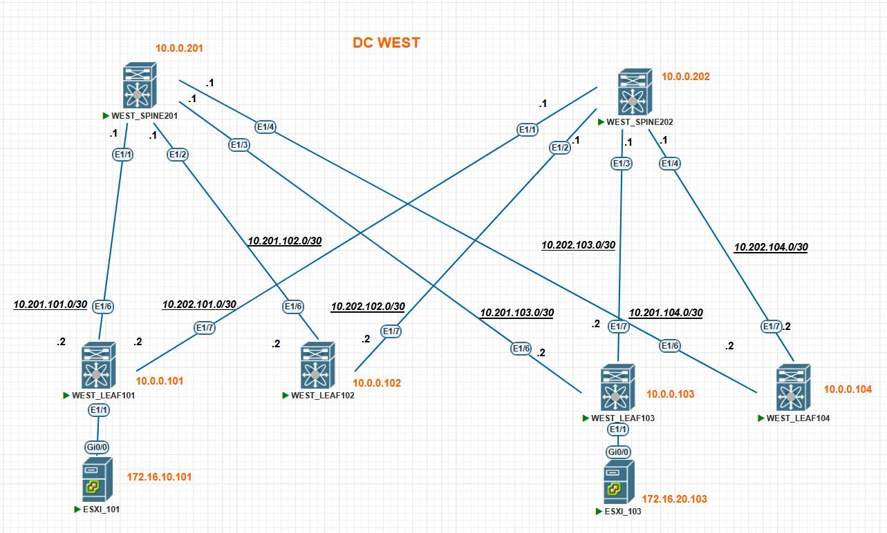

### Домашнее задание в модуле №3 урок №2 VxLAN EVPN L3 VNI

##### Цель задания
- Настройте каждого клиента в своем VNI
- Настройте маршрутизацию между клиентами.
- Зафиксируйте в документации - план работы, адресное пространство, схему сети, конфигурацию уст

---

### Результаты ДЗ

### **1. Топология сети IPv4 лабораторной работы в PnetLAB**:

Итоговая топология сети для данного ДЗ выглядит следующим образом:
 
 [](https://github.com/R0gerWilco/OTUS_DC/blob/main/Homework/Module3/Lesson02/WEST_DC_topology_for_VxLAN_L3VNI.JPG)


---

### **2. Входные данные**:

- Конфигурация Underlay/Overlay протоколов не менялась по сравнению с [прошлым ДЗ для L2VNI](https://github.com/R0gerWilco/OTUS_DC/blob/main/Homework/Module3/Lesson02/README.md)
- IPv4-адресация сохранена с предыдущей топологии,  IP-адреса коммутаторов и PtP линков указаны в [README файле первого домашнего задания](https://github.com/R0gerWilco/OTUS_DC/blob/main/Homework/Module1/Lesson03/README.md), а также отображены на схеме сети  IPv4.
- Введена в эксплуатацию  подсеть для серверов 172.16.10.0/24 c VLAN ID 10 и ассоциированным с ним VNI 10010. Шлюз по умолчанию в этой подсети 172.16.10.1
- Введена в эксплуатацию  подсеть для серверов 172.16.20.0/24 c VLAN ID 20 и ассоциированным с ним VNI 10020. Шлюз по умолчанию в этой подсети 172.16.20.1
- Обе подсети выше добавлены в VRF INTERNAL
- Поскольку у нас в лабе Nexus`ы, то тип IRB без вариантов симметричный, для маршрутизации между VNI введен в эксплуатацию VLAN 777 и ассоциированный с ним VNI 10777
- Для внутренних подсетей с VNI 10010 и VNI 10020 настроен ARP suppression, для чего на всех LEAF коммутаторах проведен тюнинг TCAM для выделения достаточного кусочка этой памяти на работу фичи. Как это все работает для Nexus 9000v решительно непонятно, но без заветной команды фича ARP suppression не включалась.

---
### **3. Типовая конфигурация VxLAN EVPN Leaf-коммутатора на примере устройства WEST_LEAF101**
```bash

feature vn-segment-vlan-based
feature nv overlay

hardware access-list tcam region arp-ether 256 double-wide

vlan 10
  name SERVERS_10
  vn-segment 10010
vlan 20
  name SERVERS_20
  vn-segment 10020
vlan 777
  vn-segment 10777

vrf context INTERNAL
  vni 10777
  rd auto
  address-family ipv4 unicast
    route-target import 64777:10777
    route-target import 64777:10777 evpn
    route-target export 64777:10777
    route-target export 64777:10777 evpn

interface Vlan10
  no shutdown
  vrf member INTERNAL
  ip address 172.16.10.1/24
  fabric forwarding mode anycast-gateway

interface Vlan20
  no shutdown
  vrf member INTERNAL
  ip address 172.16.20.1/24
  fabric forwarding mode anycast-gateway

interface Vlan777
  no shutdown
  mtu 9216
  vrf member INTERNAL
  ip forward

interface nve1
  no shutdown
  host-reachability protocol bgp
  source-interface loopback0
  member vni 10010
    suppress-arp
    ingress-replication protocol bgp
  member vni 10020
    suppress-arp
    ingress-replication protocol bgp
  member vni 10777 associate-vrf

evpn
  vni 10010 l2
    route-target import 64777:10010
    route-target export 64777:10010
  vni 10020 l2
    route-target import 64777:10020
    route-target export 64777:10020


```

### **4. Типовая конфигурация BGP Overlay Spine-коммутатора на примере устройства WEST_SPINE201**

### **5. Проверка таблицы BGP соседства и VxLAN peers на LEAF коммутаторах на примере устройства WEST_LEAF101**
```bash

WEST_LEAF101# show bgp l2vpn  evpn sum
BGP summary information for VRF default, address family L2VPN EVPN
BGP router identifier 10.0.0.101, local AS number 64777
BGP table version is 128, L2VPN EVPN config peers 2, capable peers 2
7 network entries and 10 paths using 1680 bytes of memory
BGP attribute entries [7/1148], BGP AS path entries [0/0]
BGP community entries [0/0], BGP clusterlist entries [6/24]
Neighbor        V    AS MsgRcvd MsgSent   TblVer  InQ OutQ Up/Down  State/PfxRcd
10.0.0.201      4 64777    2299    2283      128    0    0    1d13h 3                   <----------------------- SPINE 201
10.0.0.202      4 64777    2309    2294      128    0    0    1d13h 3                   <----------------------- SPINE 202


WEST_LEAF101# show nve peers
Interface Peer-IP                                 State LearnType Uptime   Router-Mac       
--------- --------------------------------------  ----- --------- -------- ----------
nve1      10.0.0.102                              Up    CP        1d13h    n/a           <----------------------- LEAF 102
nve1      10.0.0.103                              Up    CP        1d13h    n/a           <----------------------- LEAF 103            
nve1      10.0.0.104                              Up    CP        1d13h    n/a           <----------------------- LEAF 104


```

---

### **6. Проверка ARP-таблиц на LEAF коммутаторах и клиентских устройствах**
**LEAF101**
```bash
WEST_LEAF101# show ip arp vrf INTERNAL 
IP ARP Table for context INTERNAL
Total number of entries: 2
Address         Age       MAC Address     Interface       
172.16.10.101   00:05:08  504c.d600.800a  Vlan10        <----------- Хост WEST_ESXI_101 в VLAN 10  
172.16.20.101   00:05:05  504c.d600.8014  Vlan20        <----------- Хост WEST_ESXI_101 в VLAN 20  
```

**LEAF103**
```bash
WEST_LEAF103# show ip arp vrf INTERNAL
Total number of entries: 2
Address         Age       MAC Address     Interface       
172.16.20.103   00:05:10  50b0.f900.8014  Vlan20        <----------- Хост WEST_ESXI_103 в VLAN 10
172.16.10.103   00:04:54  50b0.f900.800a  Vlan10        <----------- Хост WEST_ESXI_103 в VLAN 20      
```
**WEST_ESXI_101**
```bash
WEST_ESXI_101#show ip arp
Protocol  Address          Age (min)  Hardware Addr   Type   Interface
Internet  172.16.10.1             0   0001.0001.0001  ARPA   Vlan10         <----------- Virtual MAC VLAN 10
Internet  172.16.10.101           -   504c.d600.800a  ARPA   Vlan10         <----------- Свой IP адрес в VLAN 10
Internet  172.16.10.103           8   50b0.f900.800a  ARPA   Vlan10         <----------- Хост WEST_ESXI_103 в VLAN 10
Internet  172.16.20.1             9   0001.0001.0001  ARPA   Vlan20         <----------- Virtual MAC VLAN 20
Internet  172.16.20.101           -   504c.d600.8014  ARPA   Vlan20         <----------- Хост WEST_ESXI_103 в VLAN 20
Internet  172.16.20.103         252   50b0.f900.8014  ARPA   Vlan20         <----------- Свой IP адрес в VLAN 20
```
**WEST_ESXI_103**
```bash
WEST_ESXI_103#sho ip arp
Protocol  Address          Age (min)  Hardware Addr   Type   Interface
Internet  172.16.10.1             0   0001.0001.0001  ARPA   Vlan10         <----------- Virtual MAC VLAN 10
Internet  172.16.10.101           -   504c.d600.800a  ARPA   Vlan10         <----------- Хост WEST_ESXI_101 в VLAN 10
Internet  172.16.10.103           8   50b0.f900.800a  ARPA   Vlan10         <----------- Свой IP адрес в VLAN 10
Internet  172.16.20.1             9   0001.0001.0001  ARPA   Vlan20         <----------- Virtual MAC VLAN 20
Internet  172.16.20.101           -   504c.d600.8014  ARPA   Vlan20         <----------- Свой IP адрес в VLAN 20
Internet  172.16.20.103         252   50b0.f900.8014  ARPA   Vlan20         <----------- Хост WEST_ESXI_101 в VLAN 20 
```


WEST_ESXI_101#ping 172.16.10.103 sour Vlan10
Type escape sequence to abort.
Sending 5, 100-byte ICMP Echos to 172.16.10.103, timeout is 2 seconds:
Packet sent with a source address of 172.16.10.101 
!!!!!
Success rate is 100 percent (5/5), round-trip min/avg/max = 50/66/93 ms
WEST_ESXI_101#

```
**LEAF103**
```bash
WEST_ESXI_103#show run int vlan 10
interface Vlan10
 ip address 172.16.10.103 255.255.255.0

WEST_ESXI_103#ping 172.16.10.101 sou Vlan10
Type escape sequence to abort.
Sending 5, 100-byte ICMP Echos to 172.16.10.101, timeout is 2 seconds:
Packet sent with a source address of 172.16.10.103 
!!!!!
Success rate is 100 percent (5/5), round-trip min/avg/max = 71/121/202 ms
```

---

### **7. Проверка EVPN  route-type 2/3 маршрутов на LEAF коммутаторах  WEST_LEAF101 и WEST_LEAF103**

**LEAF101**

```bash
WEST_LEAF101# show bgp l2vpn evpn  vni-id 10010
BGP routing table information for VRF default, address family L2VPN EVPN
BGP table version is 132, Local Router ID is 10.0.0.101
Status: s-suppressed, x-deleted, S-stale, d-dampened, h-history, *-valid, >-best
Path type: i-internal, e-external, c-confed, l-local, a-aggregate, r-redist, I-i
njected
Origin codes: i - IGP, e - EGP, ? - incomplete, | - multipath, & - backup, 2 - b
est2

   Network                                               Next Hop  Metric LocPrf     Weight Path
Route Distinguisher: 10.0.0.101:32777    (L2VNI 10010)

*>l[2]:[0]:[0]:[48]:[504c.d600.800a]:[0]:[0.0.0.0]/216 10.0.0.101          100      32768 i   <------------Хост WEST_ESXI_101, подключенный к своему порту
*>i[2]:[0]:[0]:[48]:[50b0.f900.800a]:[0]:[0.0.0.0]/216  10.0.0.103          100          0 i  <-----------Хост WEST_ESXI_103, подключенный к LEAF 103

*>l[3]:[0]:[32]:[10.0.0.101]/88                         10.0.0.101         100      32768 i   <------------Cвой собственный Loopback
*>i[3]:[0]:[32]:[10.0.0.102]/88                         10.0.0.102         100          0 i   <------------Loopback LEAF 102 
*>i[3]:[0]:[32]:[10.0.0.103]/88                         10.0.0.103         100          0 i   <------------Loopback LEAF 103
*>i[3]:[0]:[32]:[10.0.0.104]/88                         10.0.0.104         100          0 i   <------------Loopback LEAF 104


```

**LEAF103**

```bash
WEST_LEAF103# show bgp l2vpn evpn  vni-id 10010
BGP routing table information for VRF default, address family L2VPN EVPN
BGP table version is 132, Local Router ID is 10.0.0.103
Status: s-suppressed, x-deleted, S-stale, d-dampened, h-history, *-valid, >-best
Path type: i-internal, e-external, c-confed, l-local, a-aggregate, r-redist, I-i
njected
Origin codes: i - IGP, e - EGP, ? - incomplete, | - multipath, & - backup, 2 - b
est2

   Network                                               Next Hop  Metric LocPrf     Weight Path
Route Distinguisher: 10.0.0.101:32777    (L2VNI 10010)

*>i[2]:[0]:[0]:[48]:[504c.d600.800a]:[0]:[0.0.0.0]/216 10.0.0.101         100          0 i    <-----------Хост WEST_ESXI_101, подключенный к LEAF 101
*>l[2]:[0]:[0]:[48]:[50b0.f900.800a]:[0]:[0.0.0.0]/216 10.0.0.103         100      32768 i    <-----------Хост WEST_ESXI_103, подключенный к своему порту

*>l[3]:[0]:[32]:[10.0.0.101]/88                         10.0.0.101        100          0 i   <------------Loopback LEAF 101
*>i[3]:[0]:[32]:[10.0.0.102]/88                         10.0.0.102        100          0 i   <------------Loopback LEAF 102 
*>i[3]:[0]:[32]:[10.0.0.103]/88                         10.0.0.103        100     32768  i   <------------Cвой собственный Loopback
*>i[3]:[0]:[32]:[10.0.0.104]/88                         10.0.0.104        100          0 i   <------------Loopback LEAF 104

```
---

### **8. Скриншот BGP-апдейта с EVPN  route-type 2 маршрутом для endpoint`а WEST_ESXI_103 172.16.10.103  на коммутаторе  WEST_LEAF101**

 [](https://github.com/R0gerWilco/OTUS_DC/blob/main/Homework/Module3/Lesson02/BGP_update_reachable_route.JPG)


