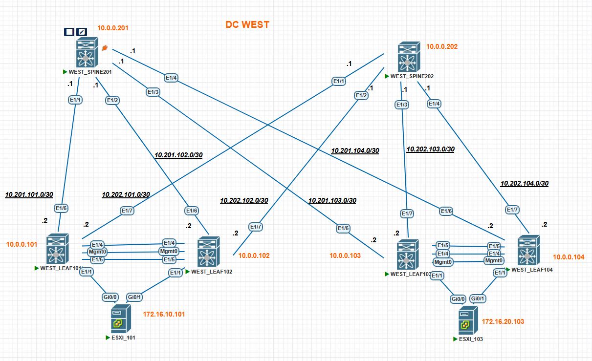

### Домашнее задание в модуле №3 урок №3 VxLAN VPC

##### Цель задания
Настроить отказоустойчивое подключение клиентов с использованием EVPN Multihoming.

- Подключить клиентов 2-я линками к различным Leaf
- Настроить агрегированный канал со стороны клиента
- Настроить multihoming для работы в Overlay сети. Если используете Cisco NXOS - vPC, если иной вендор - то ESI LAG (либо MC-LAG с поддержкой VXLAN)
- Зафиксировать в документации - план работы, адресное пространство, схему сети, конфигурацию устройств
- Опционально - протестировать отказоустойчивость - убедиться, что связнность не теряется при отключении одного из линков


---

### Результаты ДЗ

### **1. Топология сети IPv4 лабораторной работы в PnetLAB**:

Итоговая топология сети для данного ДЗ выглядит следующим образом:
 
 [](https://github.com/R0gerWilco/OTUS_DC/blob/main/Homework/Module3/Lesson02/WEST_DC_topology_for_VxLAN_VPC.JPG)


---

### **2. Входные данные**:

- Конфигурация Underlay/Overlay протоколов не менялась по сравнению с [прошлым ДЗ для L2VNI](https://github.com/R0gerWilco/OTUS_DC/blob/main/Homework/Module3/Lesson02/README.md)
- IPv4-адресация сохранена с предыдущей топологии,  IP-адреса коммутаторов и PtP линков указаны в [README файле первого домашнего задания](https://github.com/R0gerWilco/OTUS_DC/blob/main/Homework/Module1/Lesson03/README.md), а также отображены на схеме сети  IPv4.
- Оконечные узлы настроены в серверных подсетях 172.16.10.0/24 ( VLAN 10 / VNI 10010) и 172.16.20.0/24 ( VLAN 20 / VNI 10020) внутри VRF INTERNAL по агрегированному каналу с использованием протокола LACP
- Поскольку у нас в лабе Nexus`ы, то вариант multihoming топологии очевиден  - это vPC
- vPC keep-alive link настроен на mgmt0 интерфейсах коммутаторов

  #### **2.1. Таблица данных для vPC конфигурации и secondary VTEP IP**
| Устройство        | Loopback sec IP    | vPC domain | Peer-Link LACP ID | vPC priority | vPC role  | 
|-------------------|--------------------|------------|-------------------|--------------|-----------|
| **WEST_LEAF101**  | `192.168.101.102`  |   `101`    |       `101`       |    `101`     | Primary   |
| **WEST_LEAF102**  | `192.168.101.102`  |   `101`    |       `101`       |    `102`     | Secondary |
| **WEST_LEAF103**  | `192.168.103.104`  |   `103`    |       `103`       |    `103`     | Primary   |
| **WEST_LEAF104**  | `192.168.103.104`  |   `103`    |       `103`       |    `104`     | Secondary |


---
### **3. Типовая конфигурация vPC на  Leaf-коммутаторах на примере устройства WEST_LEAF101**
```bash

feature vpc

vpc domain 101
  peer-switch
  role priority 101
  peer-keepalive destination 192.168.0.102 source 192.168.0.101
  peer-gateway
  ip arp synchronize

interface port-channel101
  switchport mode trunk
  spanning-tree port type network
  vpc peer-link

interface Ethernet1/4
  description **vPC peer-link **
  switchport mode trunk
  channel-group 101 mode active

interface Ethernet1/5
  description **vPC peer-link **
  switchport mode trunk
  channel-group 101 mode active


interface port-channel1
  switchport mode trunk
  switchport trunk allowed vlan 10
  spanning-tree port type edge trunk
  spanning-tree bpdufilter enable
  mtu 9216
  vpc 1

interface Ethernet1/1
  switchport mode trunk
  switchport trunk allowed vlan 10
  mtu 9216
  channel-group 1 mode active

interface loopback0
  description LoopBack_LEAF101
  ip address 10.0.0.101/32
  ip address 192.168.101.102/32 secondary
  ip router ospf UNDERLAY area 0.0.0.0

```
### **4. Диагностика vPC на LEAF коммутаторах на примере устройства WEST_LEAF101**
```bash
WEST_LEAF101# show vpc
vPC domain id                     : 101 
Peer status                       : peer adjacency formed ok      
vPC keep-alive status             : peer is alive                 
Configuration consistency status  : success 
Per-vlan consistency status       : success                       
Type-2 consistency status         : success 
vPC role                          : primary                       
Number of vPCs configured         : 1   
Peer Gateway                      : Enabled
Dual-active excluded VLANs        : -
Graceful Consistency Check        : Enabled
Auto-recovery status              : Disabled
Delay-restore status              : Timer is off.(timeout = 30s)
Delay-restore SVI status          : Timer is off.(timeout = 10s)
Operational Layer3 Peer-router    : Disabled
Virtual-peerlink mode             : Disabled

vPC Peer-link status
---------------------------------------------------------------------
id    Port   Status Active vlans    
--    ----   ------ -------------------------------------------------
1     Po101  up     1,10,777                                                    
         
vPC status
----------------------------------------------------------------------------
Id    Port          Status Consistency Reason                Active vlans
--    ------------  ------ ----------- ------                ---------------
1     Po1           up     success     success               10           


WEST_LEAF101# show vpc role

vPC Role status
----------------------------------------------------
vPC role                        : primary                       
Dual Active Detection Status    : 0
vPC system-mac                  : 00:23:04:ee:be:65             
vPC system-priority             : 32667
vPC local system-mac            : 50:93:15:00:e7:07             
vPC local role-priority         : 101 
vPC local config role-priority  : 101 
vPC peer system-mac             : 50:79:06:00:f2:07             
vPC peer role-priority          : 102 
vPC peer config role-priority   : 102 

```

---


### **5. Проверка маршрутов  для клиентских IP на LEAF коммутаторах**

**LEAF101/LEAF102**
```bash

WEST_LEAF101# show ip route bgp-64777  vrf INTERNAL

172.16.20.103/32, ubest/mbest: 1/0                                    <----------- Хост WEST_ESXI_103 в VLAN 20 через L3VNI 10777 и secondary IP vPC пары LEAF103/LEAF104 
    *via 192.168.103.104%default, [200/0], 11:55:34, bgp-64777, internal, tag 64777 (evpn)
 segid: 10777 tunnelid: 0xc0a86768 encap: VXLAN
 
 ```

**LEAF103/LEAF104**
```bash
WEST_LEAF103# show ip route bgp-64777  vrf INTERNAL

172.16.10.101/32, ubest/mbest: 1/0                                     <----------- Хост WEST_ESXI_101 в VLAN 10  через L3VNI 10777 и secondary IP vPC пары LEAF101/LEAF102
    *via 192.168.101.102%default, [200/0], 12:09:50, bgp-64777, internal, tag 64
777 (evpn) segid: 10777 tunnelid: 0xc0a86566 encap: VXLAN

```

### **6. Проверка связности на клиентских устройствах между VLAN 10 и VLAN 20**
**WEST_ESXI_101**
```bash
WEST_ESXI_101#ping 172.16.20.103 sour Vlan10                              <----------- пинг узла в  VLAN 20 от имени VLAN 10
Type escape sequence to abort.
Sending 5, 100-byte ICMP Echos to 172.16.20.103, timeout is 2 seconds:
Packet sent with a source address of 172.16.10.101 
!!!!!
Success rate is 100 percent (5/5), round-trip min/avg/max = 218/470/797 ms

```
**WEST_ESXI_103**
```bash
WEST_ESXI_103#ping 172.16.10.101 sou Vlan20                               <----------- пинг узла в  VLAN 10 от имени VLAN 20
Type escape sequence to abort.
Sending 5, 100-byte ICMP Echos to 172.16.10.101, timeout is 2 seconds:
Packet sent with a source address of 172.16.20.103 
!!!!!
Success rate is 100 percent (5/5), round-trip min/avg/max = 249/377/620 ms
```

---

### **8. Проверка EVPN  route-type 2 маршрутов для клиентских узлов на примере устройства  WEST_LEAF101**

**LEAF101**

```bash
WEST_LEAF101# show bgp l2vpn evpn
BGP routing table information for VRF default, address family L2VPN EVPN
BGP table version is 14097, Local Router ID is 10.0.0.101
Status: s-suppressed, x-deleted, S-stale, d-dampened, h-history, *-valid, >-best
Path type: i-internal, e-external, c-confed, l-local, a-aggregate, r-redist, I-i
njected
Origin codes: i - IGP, e - EGP, ? - incomplete, | - multipath, & - backup, 2 - b
est2

   Network            Next Hop            Metric     LocPrf     Weight Path
Route Distinguisher: 10.0.0.101:32777    (L2VNI 10010)
*>l[2]:[0]:[0]:[48]:[504c.d600.800a]:[0]:[0.0.0.0]/216
                      192.168.101.102                   100      32768 i
*>l[2]:[0]:[0]:[48]:[504c.d600.800a]:[32]:[172.16.10.101]/272                       <----------- Хост WEST_ESXI_101 в VNI 10010  от своего общего VTEP Secondary IP 192.168.101.102 
                      192.168.101.102                   100      32768 i

Route Distinguisher: 10.0.0.103:32787
*>i[2]:[0]:[0]:[48]:[50b0.f900.8014]:[0]:[0.0.0.0]/216
                      192.168.103.104                   100          0 i
* i                   192.168.103.104                   100          0 i
* i[2]:[0]:[0]:[48]:[50b0.f900.8014]:[32]:[172.16.20.103]/272
                      192.168.103.104                   100          0 i
*>i                   192.168.103.104                   100          0 i


Route Distinguisher: 10.0.0.104:32787
*>i[2]:[0]:[0]:[48]:[50b0.f900.8014]:[32]:[172.16.20.103]/272
                      192.168.103.104                   100          0 i
* i                   192.168.103.104                   100          0 i
*>i[3]:[0]:[32]:[192.168.103.104]/88
                      192.168.103.104                   100          0 i
* i                   192.168.103.104                   100          0 i

Route Distinguisher: 10.0.0.101:3    (L3VNI 10777)
*>i[2]:[0]:[0]:[48]:[50b0.f900.8014]:[32]:[172.16.20.103]/272
                      192.168.103.104                   100          0 i
* i                   192.168.103.104                   100          0 i


   Network            Next Hop            Metric     LocPrf     Weight Path
Route Distinguisher: 10.0.0.101:32777    (L2VNI 10010)
*>l[2]:[0]:[0]:[48]:[504c.d600.800a]:[0]:[0.0.0.0]/216 10.0.0.101                        100      32768 i         
*>l[2]:[0]:[0]:[48]:[504c.d600.800a]:[32]:[172.16.10.101]/272 10.0.0.101                        100      32768 i  <----------- Хост WEST_ESXI_101 в VNI 10010  


Route Distinguisher: 10.0.0.101:32787    (L2VNI 10020)
*>i[2]:[0]:[0]:[48]:[50b0.f900.8014]:[0]:[0.0.0.0]/216  10.0.0.103                        100          0 i     
*>i[2]:[0]:[0]:[48]:[50b0.f900.8014]:[32]:[172.16.20.103]/272 10.0.0.103                        100          0 i  <----------- Хост WEST_ESXI_103 в VNI 10020 

    Route Distinguisher: 10.0.0.101:3    (L3VNI 10777)
*>i[2]:[0]:[0]:[48]:[50b0.f900.8014]:[32]:[172.16.20.103]/272 10.0.0.103                        100          0 i  <----------- Хост WEST_ESXI_103 в L3 VNI 10070 
```


### **8. Скриншот дампа траффика с L3VNI**

 [](https://github.com/R0gerWilco/OTUS_DC/blob/main/Homework/Module3/Lesson02/WEST_DC_ping_for_VxLAN_L3VNI.JPG)


